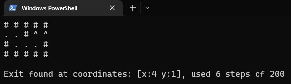
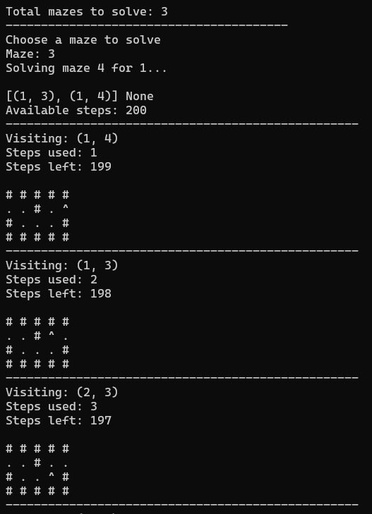

# Download
```
git clone https://github.com/juhamikael/maze.git
```

If you download via Zip, change the folder/file name from `maze-main` back to `maze` 

### Locate and open the downloaded folder in your machine

# Install
```
python -m venv venv
venv\Scripts\activate
pip install -r requirements.txt
```

### More info about packages
[Pypi Blessed](https://pypi.org/project/blessed/)  
[Pypi Pytest](https://pypi.org/project/pytest/)
---

# Video
https://user-images.githubusercontent.com/83360104/208979549-8a9b844c-6d74-4f5c-86bb-37d80039a099.mp4

---
# How does it work and what is this?

This is a maze solver that uses the Depth First Search Algorithm to find the shortest path from the start to the end of the maze. 
The maze is displayed in the terminal by utilizing the blessed package and the blessed.Terminal() class.

To create a maze in a .txt file, use the following format: 
```
########
^ #    #
# # ## #
#   ## E
########
```
Where:
* `#` Is a wall
* `' '` Is a path
* `^` Is the start / player
* `E` Is the end / goal

The name of the file should be in the format of 'maze-task-xyz.txt', where 'xyz' is the number of the maze.  
The program will read the maze from the file and turn it into 1's and 0's.

## It is recommend to create a new folder e.g. `mazes-to-solve` inside project folder and move the mazes inside that folder.
## Before running the program, change the path in the `config.ini` file to the folder where the mazes are located e.g. mazes-to-solve . 

# run the program with command `python run.py`

First, the program asks for the name of the player, and checks if there are any mazes in the folder.  
If so, the user is redirected to the menu screen, where they can choose:

1. Solve a maze / maze_to_solve
2. Steps to solve a maze. / (20 steps, 150 steps, 200 steps or custom selection)
3. Exit

After running the maze, the results are written to 'path/solution/name_maze-x_solution.txt'."
...

Else, the program will exit.


# How to run tests?
```
python -m pytest
```

# Bugs
## Wrong starting position after one run
  
At this point, everything looks normal. 
The maze is solved, and the coordinates and steps are displayed on the screen.

However, if we run the same maze again, we get this:

  
Our starting points are now [(1,3) and (1,4)], while they should be [(1,0)]. 
This means that the maze starts at the point where it stopped last time.

